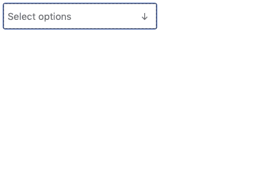

# 🥢 React Select Zero

<p align="center">
  
</p>

Lightweight, accessible, zero-dependency combobox alternative to
[react-select][react-select]. Supports single selection, multiselection,
search, and full keyboard controls in a handsome `5 KB` component (`1.8 KB`
gzipped).

### Comparison

react-select-zero sheds most of its weight through zero dependencies, but it
also gets a boost from React Hooks, modern JS, and leveraging HTML and
browser functionality wherever possible rather than JS logic (e.g.:
`<button>`s are used in many places, which don’t require <kbd>enter</kbd> and
<kbd>space</kbd> keybindings—only an `onClick` callback).

| Name                                   |   Minified | Minified + gzip |
| :------------------------------------- | ---------: | --------------: |
| `@manifoldco/react-select-zero`        | 🔥`5 KB`🔥 |        `1.8 KB` |
| `@zendeskgarden/react-selection@6.0.1` |  `26.6 KB` |        `6.6 KB` |
| `downshift`                            |  `21.9 KB` |        `7.1 KB` |
| `rc-select`                            | `164.3 KB` |       `46.3 KB` |
| `react-select`                         |  `86.6 KB` |       `26.1 KB` |

## 🍚 Usage

```bash
npm i @manifoldco/react-select-zero
```

### Basic usage

```jsx
const [selection, setSelection] = useState([]);

return (
  <Select
    name="pokemon"
    options={['Bulbasaur', 'Charmander', 'Squirtle']}
    onChange={setSelection} // ['Bulbasaur']
    value={selection}
  >
    Select a Pokémon
  </Select>
);
```

_Note: `onChange` always returns an array, even in single selection mode._

### Multi selection

```jsx
const [selection, setSelection] = useState([]);

return (
  <Select
    multi
    name="pokemon"
    onChange={setSelection}
    options={['Bulbasaur', 'Charmander', 'Squirtle']}
    value={selection}
  >
    Select a Pokémon
  </Select>
);
```

### Set initial selection

```jsx
const [selection, setSelection] = useState(['Bulbasaur']);

return (
  <Select
    name="pokemon"
    onChange={setSelection}
    options={['Bulbasaur', 'Charmander', 'Squirtle']}
    value={selection}
  >
    Select a Pokémon
  </Select>
);
```

### Hide search (shown by default)

```jsx
const [selection, setSelection] = useState([]);

return (
  <Select
    noSearch
    name="pokemon"
    onChange={setSelection}
    options={['Bulbasaur', 'Charmander', 'Squirtle']}
    value={selection}
  >
    Select a Pokémon
  </Select>
);
```

_Note: search won’t appear if there are fewer than 5 items_

### Allow creation of new entry (works for single and multi)

```jsx
const [selection, setSelection] = useState([]);

return (
  <Select
    name="pokemon"
    options={['Bulbasaur', 'Charmander', 'Squirtle']}
    allowCreate
    onChange={setSelection} // ['Bulbasaur', 'Charmander', 'Squirtle', 'Missingno']
    value={selection}
  >
    Select a Pokémon
  </Select>
);
```

User-created values will appear in the same array. To determine new from
existing, you’ll have to scan the `options` you passed for any differences,
e.g.:

```js
onChange={
  (newVal) => {
    const created = newVal.filter(val => !options.includes(val));
    const existing = newVal.filter(val => options.includes(val));
    setCreated(created);
    setExisting(existing);
  }
}
```

### All Props

| Name           | Type                 | Default    | Description                                                                                     |
| :------------- | :------------------- | :--------- | :---------------------------------------------------------------------------------------------- |
| **`name`**     | `string`             |            | **Required** Form name of this input. Query this like a normal form input. Also assits in a11y. |
| **`onChange`** | `(string[]) => void` |            | **Required** Form callback called when state changes                                            |
| **`options`**  | `string[]`           |            | **Required** Array of strings to display as options                                             |
| **`value`**    | `string[]`           |            | **Required** Set selected values                                                                |
| `allowCreate`  | `boolean`            | `false`    | Set `<Select allowCreate />` to allow creating new entries (note: `noSearch` can’t be set)      |
| `max`          | `number`             | `Infinity` | Set maximum number of items (only works with `multi`)                                           |
| `multi`        | `boolean`            | `false`    | Set `<Select multi />` to allow multiple selection                                              |
| `noSearch`     | `boolean`            | `false`    | Set `<Select noSearch />` to hide searching (by default shows with > 5 options)                 |
| `placeholder`  | `string`             |            | Specify placeholder text                                                                        |

## 💅 Styling

This component ships with some lightweight styles to extend. Either import
them like so:

```js
import '@manifoldco/react-select-zero/assets/react-select-zero.css';
```

Or copy the [CSS][styles] directly, and modify as you wish. There are some
CSS variables you can overwrite to control colors & background images.

Alternatively, you can also use [Styled Components][styled-components] or
your favorite CSS-in-JS solution to extend the existing styles:

```jsx
import styled from 'styled-components';
import Select from '@manifoldco/react-select-zero';

const StyledSelect = styled(Select)`
  /* overrides go here */
`;

<StyledSelect name="dropdown" options={options} />;
```

## Accessibility

This component ships with the following accessibility features out-of-box:

- [x] [listbox][listbox] role with `aria-expanded`, `aria-haspopup`, and `aria-multiselectable` properties
- [x] Focusable main input
- [x] Keyboard <kbd>↓</kbd> opens dropdown when focused
- [x] Keyboard <kbd>↑</kbd>/<kbd>↓</kbd> navigation through items
- [x] Keyboard <kbd>enter</kbd> to select items
- [x] Keyboard <kbd>Home</kbd>/<kbd>End</kbd> to jump to beginning/end of list
- [x] Keyboard <kbd>esc</kbd> to close the combo box
- [x] Searchable items
- [x] Removal of multiselect items also fully keyboard-navigable

### Using labels

This component doesn’t come with a label, but you can add one yourself! This
component will pass through any additional properties to the root element
that also has `[role="listbox"]`.

```jsx
import React from 'react';
import Select from '@manifoldco/react-select-zero';

const MySelect = () => (
  <>
    <label htmlFor="country" id="country-label"></label>
    <Select aria-labelledby="country-label" id="country" name="country" options={options} />
  </>
);
```

[listbox]: https://developer.mozilla.org/en-US/docs/Web/Accessibility/ARIA/Roles/listbox_role
[styles]: ./src/styles.css
[react-select]: https://github.com/JedWatson/react-select
[styled-components]: https://www.styled-components.com/
